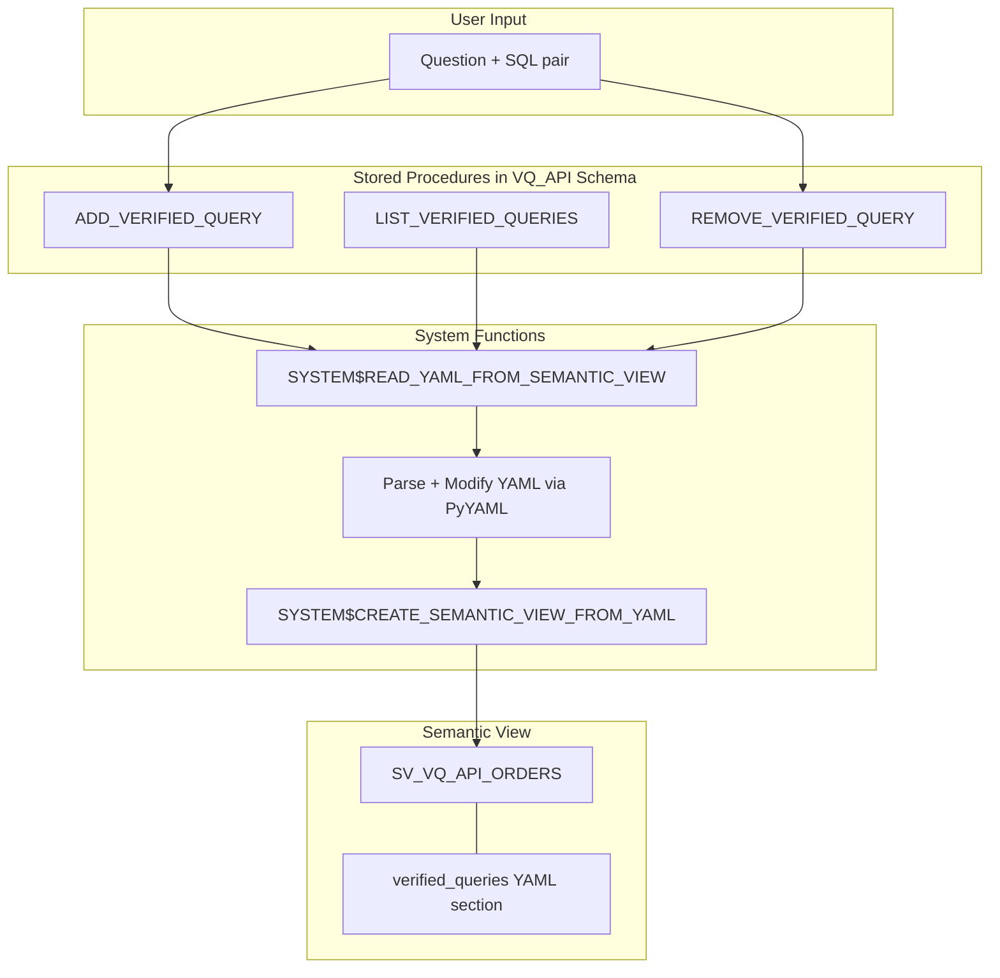
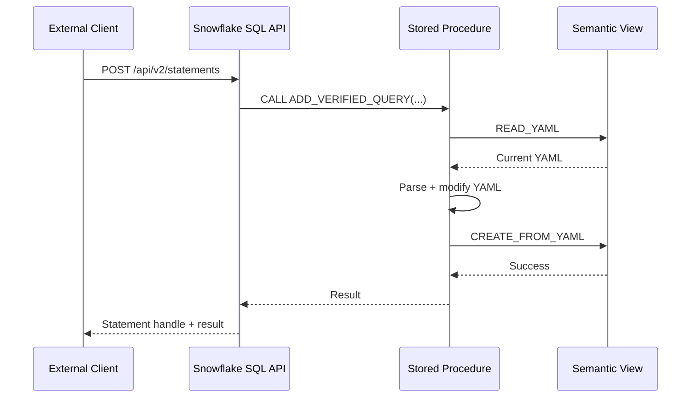
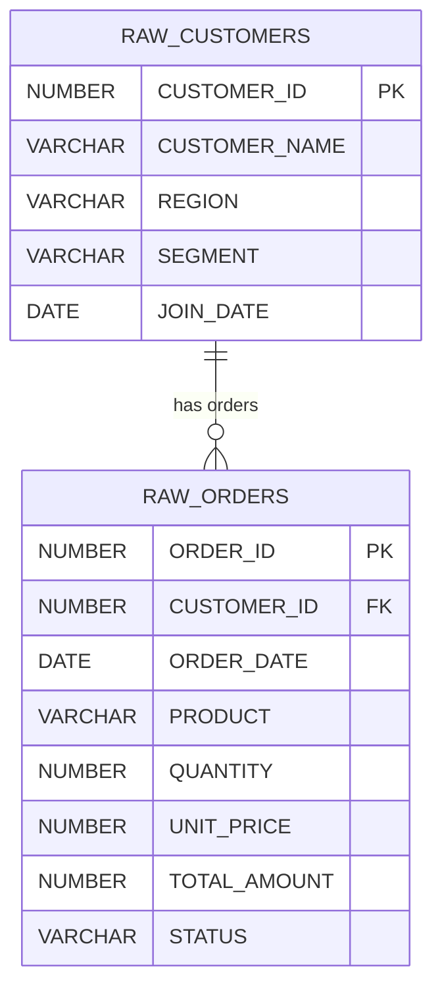

# Verified Query API - Data Flow

## Procedure Flow

```mermaid
flowchart TD
    subgraph input [User Input]
        Q["Question + SQL pair"]
    end

    subgraph procs [Stored Procedures in VQ_API Schema]
        ADD[ADD_VERIFIED_QUERY]
        LIST[LIST_VERIFIED_QUERIES]
        REM[REMOVE_VERIFIED_QUERY]
    end

    subgraph system [System Functions]
        READ["SYSTEM$READ_YAML_FROM_SEMANTIC_VIEW"]
        PARSE["Parse + Modify YAML via PyYAML"]
        CREATE["SYSTEM$CREATE_SEMANTIC_VIEW_FROM_YAML"]
    end

    subgraph sv [Semantic View]
        SV["SV_VQ_API_ORDERS"]
        VQ["verified_queries YAML section"]
    end

    Q --> ADD
    Q --> REM
    ADD --> READ
    LIST --> READ
    REM --> READ
    READ --> PARSE
    PARSE --> CREATE
    CREATE --> SV
    SV --- VQ
```

## SQL API Integration

```mermaid
sequenceDiagram
    participant Client as External Client
    participant API as Snowflake SQL API
    participant SP as Stored Procedure
    participant SV as Semantic View

    Client->>API: POST /api/v2/statements
    API->>SP: CALL ADD_VERIFIED_QUERY(...)
    SP->>SV: READ_YAML
    SV-->>SP: Current YAML
    SP->>SP: Parse + modify YAML
    SP->>SV: CREATE_FROM_YAML
    SV-->>SP: Success
    SP-->>API: Result
    API-->>Client: Statement handle + result
```

## Data Model

```mermaid
erDiagram
    RAW_CUSTOMERS ||--o{ RAW_ORDERS : "has orders"
    RAW_CUSTOMERS {
        NUMBER CUSTOMER_ID PK
        VARCHAR CUSTOMER_NAME
        VARCHAR REGION
        VARCHAR SEGMENT
        DATE JOIN_DATE
    }
    RAW_ORDERS {
        NUMBER ORDER_ID PK
        NUMBER CUSTOMER_ID FK
        DATE ORDER_DATE
        VARCHAR PRODUCT
        NUMBER QUANTITY
        NUMBER UNIT_PRICE
        NUMBER TOTAL_AMOUNT
        VARCHAR STATUS
    }
```
